# GhostCite

[](https://github.com/vaani1127/GhostCite/actions/workflows/ci.yml)
[](LICENSE)
[](pyproject.toml)

**LLM-written papers cite papers that do not exist. GhostCite checks every reference
against live Google Scholar data.**

Give it a PDF, a BibTeX file or a pasted reference list. GhostCite parses each reference,
looks it up on Google Scholar through [SerpApi](https://serpapi.com), compares the
authors, year and venue, and explains every verdict in one plain sentence:

| Verdict | Meaning | Example reason |
| --- | --- | --- |
| **Verified** | A Scholar record matches the title, authors, year and venue. | "Title, authors, year and venue match a Google Scholar record (cited by 274,507)." |
| **Metadata mismatch** | The paper exists, but the citation gets something wrong. | "Title matches, but year is 2015, not 2019. (Google Scholar lists this work with 20 versions; this may be a different version.)" |
| **Not found** | No Scholar record matches; the reference may be fabricated. | "No Google Scholar record was found for this title." |
| Unparseable / Skipped | No title could be read, or the search budget ran out. | Shown separately; never counted as a pass or a fail. |

There is no LLM anywhere in the pipeline. Verdicts are deterministic and reproducible.

**Hosted demo:** <https://ghostcite.vaaniprashar.tech>. It runs in demo mode only. The
first load can take about a minute because the free instance sleeps when idle. Live
checks need a local run with your own SerpApi key (below).

## Try it in 30 seconds (no API key)

GhostCite ships with recorded Google Scholar responses for a sample bibliography of real
and fabricated references, so you can try it without an account.

```bash
git clone https://github.com/vaani1127/GhostCite.git
cd GhostCite
python -m venv .venv
# Windows (PowerShell):  .venv\Scripts\Activate.ps1
# macOS / Linux:         source .venv/bin/activate
pip install .
ghostcite check --demo           # checks samples/sample.bib from the recorded responses
ghostcite web                    # open http://127.0.0.1:8000 and click "Try the sample"
```

Expected result: 6 verified, 4 metadata mismatches, 1 not found, integrity score
72.7 / 100, 0 searches used. Python 3.11 or newer is required.

## Check your own references

1. Get a SerpApi key (the free plan works) from <https://serpapi.com/manage-api-key>.
2. Copy `.env.example` to `.env` and set `SERPAPI_API_KEY=...`. The key is read only from
   the environment or `.env`; it is never logged, and it is removed from every error
   message.
3. Run a check:

```bash
ghostcite check paper.pdf                       # table in the terminal
ghostcite check refs.bib -f html -o report.html # self-contained HTML report
ghostcite check refs.bib -f sarif -o refs.sarif # for GitHub code scanning
ghostcite check refs.txt --fail-on 1            # exit code 1 if anything is wrong
ghostcite check refs.bib --offline              # cached results only, never spends
ghostcite web                                   # local web UI on 127.0.0.1:8000
```

Formats: `table` (default), `json`, `md`, `html`, `sarif`. Exit codes:
* `0`: success
* `1`: the `--fail-on` threshold was reached
* `2`: bad input, or no API key
* `3`: SerpApi refused the request, or the account cannot afford the run

The **integrity score** is
`100 × (verified + 0.5 × mismatched) / (verified + mismatched + not found)`.
Unparseable and skipped references are excluded and shown separately.

## How GhostCite uses SerpApi

Every search goes through SerpApi's official Python client, and every search is planned
to cost as little as possible.

* **Google Scholar API (primary)**: `engine=google_scholar`, `hl=en`. A two-step plan,
  stopping at the first confident match:
  1. The **exact title in quotes**. This finds most real papers in one search.
  2. The **title plus `author:"surname"`**. This recovers typos, reworded titles and
     subtitle differences.

  Each organic result becomes a candidate: title, authors, year, venue, "cited by" and
  the number of versions. GhostCite scores every candidate on the page and keeps the one
  that agrees on the most fields.
* **Google Search API (fallback)**: `engine=google`, `gl=in`, `hl=en`, used only for
  books, theses and reports that Scholar indexes poorly. The **Knowledge Graph** panel
  supplies the title, authors and year. A Google-only match is capped at 0.7 confidence,
  and its reason says the authors and venue could not be confirmed.
* **Account API (free)**: read once before a live run. GhostCite extracts only the
  searches left and the hourly limit; the rest of the response, which includes the key
  and the account e-mail, is discarded and never logged.
  * **Preflight**: if the account cannot afford the estimated searches, the run is
    refused before anything is spent.
  * **Pacing**: live calls are paced to at most 80% of the account's hourly limit.
* **Caching and budgets**:
  * Responses are cached locally in SQLite for 30 days. The key is a hash of the query
    without the API key, so repeating a check costs 0 searches, and duplicate references
    in one document are searched once.
  * Every run has a hard `--max-searches` cap. The web UI adds a per-job cap (30) and a
    per-server cap (100).
  * Timeouts are retried after at least 15 seconds with identical parameters. If
    SerpApi's own one-hour cache answered the retry, it is not counted twice.
  * Every live run appends its search count to a local credits log.

In the frozen evaluation, 26 references cost 29 searches, about 1.1 per reference.

## Architecture

```mermaid
flowchart LR
    A[PDF / .bib / text] --> B[ingest<br/>text, BibTeX, references section]
    B --> C[parse<br/>split, authors, title, year, venue]
    C --> D[pipeline<br/>dedupe, thread pool, budget]
    D --> E[planner<br/>exact title → title + author → Google fallback]
    E --> F[search client<br/>cache → budget → pacing → SerpApi]
    F -->|Scholar API| G[Scholar parser]
    F -->|Google API| H[Knowledge Graph parser]
    G --> I[match<br/>title, authors, year, venue]
    H --> I
    I --> J[verdict rules<br/>verdict + reason + confidence]
    J --> K[reports<br/>table, JSON, Markdown, HTML, SARIF]
    K --> L[CLI · web UI · GitHub Action]
```



Details are in [docs/ARCHITECTURE.md](docs/ARCHITECTURE.md).

## Evaluation

The headline result comes from a **frozen held-out set (v2)** of 26 references that
share no paper with the set used for tuning:
* 16 real papers: psychology, statistics, chemistry, ecology, earth science, materials
  science, sociology, and 7 Indian journal articles and books.
* 10 fabricated references: reworded titles, swapped authors, wrong years, fake venues
  and fully invented papers.

Every real reference was validated against Crossref, never against GhostCite. The dataset
was hashed before any search and run exactly once, and no code was changed afterwards.

| Frozen held-out v2 (raw strings and BibTeX gave identical results) | Result |
| --- | --- |
| False alarms on real references | **1/16 = 6.2%** (95% CI 1.1 to 28.3) |
| Detection of fabricated references | **8/10 = 80.0%** (95% CI 49.0 to 94.3) |
| Indian journals and books: false alarms | 0/7 = 0.0% (95% CI 0.0 to 35.4) |
| Indian journals and books: detection | 4/5 = 80.0% (95% CI 37.6 to 96.4) |
| By fabrication type (2 each) | reworded 2/2, swapped authors 2/2, wrong year 2/2, fake venue 0/2, invented 2/2 |

**Small sample; treat these as indicative, not definitive.**
[docs/EVALUATION.md](docs/EVALUATION.md) has the method, the earlier v1 evaluation (67
references with a tuning/test split), the post-fix rerun clearly marked as not held-out,
and every failure with its cause. To reproduce with no key, run
`python eval/run.py --dataset v2`.

## Known limitations

* **One-word venues are not compared.** To avoid false alarms on acronyms ("NeurIPS"
  vs. the full name), GhostCite only judges venues with at least two significant words. A
  fake venue on a paper really published in *Nature* or a single-word journal name is
  therefore missed. This affected 0/2 fake-venue rows in v1's first held-out run and 0/2
  in v2.
* **Reprints of classic papers.** When Google Scholar's main record for a classic paper
  is a later reprint, GhostCite can report a wrong year. Examples are Akerlof's 1970
  "market for lemons" (shown as 1978) and Granovetter's 1973 "strength of weak ties"
  (shown as 1977). The reason says how many versions Scholar lists, so a reader can
  check quickly.
* **Google Scholar's layout can change.** It changed on the day of our evaluation (see
  the story below). Recorded fixtures now cover both layouts, but a future change could
  break parsing again.
* **Small evaluation sample.** See the confidence intervals above.
* **Not found means "not found here".** Sources Scholar does not index, such as old
  books or regional journals, can come back Not found even though they exist.

## The story: Scholar changed under us

On the day of the first held-out evaluation, six of the nine failures came from one
cause. Google Scholar had started serving a new result layout in which the author list
and the venue are glued together, with a bullet before the source:
`FD DavisMIS quarterly, 1989•JSTOR` instead of `FD Davis - MIS quarterly, 1989 - JSTOR`.
The parser read the whole string as the author's name. As a result, real papers looked
mismatched, and fake venues and years went unnoticed.

We added a parser for the new layout that relies on Scholar's structured author list,
recorded three real responses in that layout as test fixtures, and reported the
pre-fix numbers as the honest held-out result. We then built the fresh v2 set to measure
the fixed code. In v2, 11 of the 29 first results used the new layout, and none of the
failures came from it.

## GitHub Action

Check every `.bib` file in a repository and show problems as code-scanning alerts on the
exact line:

```yaml
permissions:
  contents: read
  security-events: write
steps:
  - uses: actions/checkout@v7
  - uses: vaani1127/GhostCite@main   # pin a release tag or commit SHA in production
    with:
      serpapi-api-key: ${{ secrets.SERPAPI_API_KEY }}
      files: "**/*.bib"
      fail-on: "1"
```

The SARIF upload happens before the `fail-on` check, so alerts appear even when the job
fails. See [docs/examples/ghostcite-workflow.yml](docs/examples/ghostcite-workflow.yml).

## Docker

```bash
cp .env.example .env        # add your key, or leave it empty for demo mode
docker compose up --build   # http://127.0.0.1:8000
```

The image runs as a non-root user and never contains your key: it comes from `.env` at
run time. Inside the container the server must listen on `0.0.0.0` so the port can be
published. `compose.yaml` publishes it on `127.0.0.1` only, so it is not reachable from
other machines. The search cache lives in a named volume.

## Privacy and safety

* **Local only**: the web UI binds to `127.0.0.1` by default and warns if you choose
  another interface.
* **No stored uploads**: uploads are processed in memory and never written to disk. There
  are no cookies, no analytics and no external assets.
* **Hard caps in the web UI**: upload size, references per job, concurrent jobs, and
  searches per job and per server.
* **Clean recordings**: committed responses are trimmed and sanitized, and a test fails
  if any committed fixture contains a key-shaped string, an e-mail address or a link into
  a SerpApi account.

## Development

```bash
pip install -e ".[dev]"
pre-commit install
python tasks.py check     # ruff, ruff format --check, mypy --strict, pytest (coverage >= 90%)
```

Tests never touch the network: `pytest-socket` blocks it. See
[CONTRIBUTING.md](CONTRIBUTING.md). Hypothesis (MPL-2.0) is used only in tests and is
never shipped.

## Roadmap

* A curated venue list, so one-word venues such as *Nature* and *Science* can be compared
  safely.
* Reprint-aware matching, validated on a fresh held-out set before it ships.
* More Indian sources: indexes for Indian journals that Scholar covers poorly.

## AI disclosure

GhostCite was built with [Claude Code](https://claude.com/claude-code) as a coding
assistant, in seven checkpoints. At each checkpoint, a human reviewed the code, the test
results and the evaluation before continuing. The evaluation design (held-out splits,
frozen v2, honest reporting) was set by the humans. The product itself uses no AI: every
verdict comes from deterministic comparison with Google Scholar data.

## License

[Apache-2.0](LICENSE). Copyright 2026 Vaani Prashar and Dhruv Goyal.
