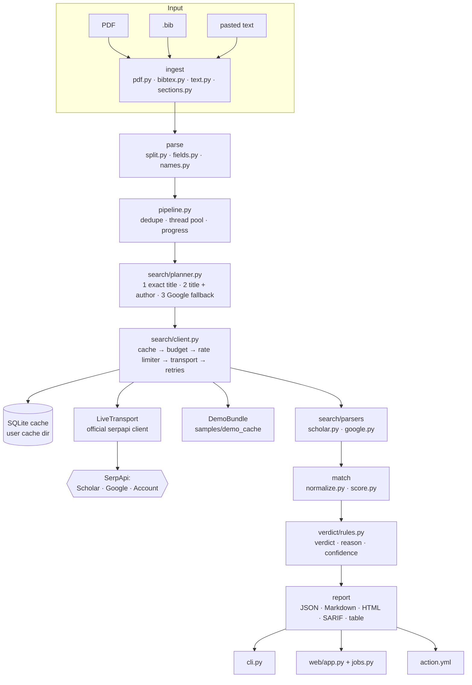

# GhostCite architecture

GhostCite is a deterministic pipeline: no LLM and no learned model. Every verdict can be
traced to a parsed field, a recorded search response and a rule.

## Modules

| Module | Responsibility |
| --- | --- |
| `ingest/` | Bytes to reference text. `pdf.py` uses pypdf in layout mode, splits two columns, removes repeated headers and footers, and joins hyphenated line ends. `sections.py` finds the references section (the last "References", "Bibliography" and similar heading; it stops at appendices). `bibtex.py` uses bibtexparser v2 and reports failed blocks with line numbers. Scanned PDFs with no text raise a clear error. |
| `parse/` | Reference text to `ParsedFields`. `split.py` detects the list style (`[1]`, `1.`, author-year) and splits. `fields.py` extracts the DOI, year, title (quoted or positional) and venue for APA, IEEE, Vancouver and Indian journal styles, and guesses the entry type. `names.py` handles initials, "et al.", particles and Indian name orders. BibTeX entries skip these heuristics. |
| `pipeline.py` | Dedupes identical references (all fields), runs them on a bounded thread pool, and stops searching a reference at the first confident match. |
| `search/planner.py` | Ordered queries: Scholar exact quoted title, then Scholar title + `author:"surname"`, then Google (`gl=in`) only for books, theses and reports. A reference with no title is UNPARSEABLE and costs nothing. |
| `search/client.py` | Cache first, then the budget, then the rate limiter, then the transport. Retries 429, 5xx and network errors with jittered backoff. A timed-out request may have been billed, so it counts as used. It is retried after at least 15 s with identical parameters (never `no_cache`). If SerpApi's one-hour cache answered the retry (detected from `search_metadata.created_at`), the retry is not counted again. A single-flight lock per cache key prevents concurrent duplicate searches. |
| `search/cache.py` | SQLite cache in the OS user cache directory, keyed by the SHA-256 of the canonical parameters *without* the API key. 30-day TTL; `ghostcite cache stats/clear`. |
| `search/budget.py`, `ratelimit.py`, `account.py` | Hard search caps (per run, per web job, per web server). A token-bucket limiter at 80% of the account's hourly limit. Account API preflight that extracts counts only. |
| `search/backends.py`, `sanitize.py` | `LiveTransport` (the only network code), `DemoBundle` (read-only recorded responses) and `RecordingStore` (builds replay bundles). Every stored response is sanitized (no key, no archive links) and trimmed to the fields GhostCite reads. |
| `search/parsers/` | `scholar.py` parses organic results in both summary layouts: the classic `Authors - Venue, Year - Source` and the newer bullet layout `AuthorsVenue, Year•Source`. It reads "cited by" and versions counts. `google.py` turns the Knowledge Graph into a candidate. |
| `match/` | `normalize.py` folds case, accents, LaTeX, Greek letters, hyphenation, number words and British spellings into canonical words. `score.py` compares each field. Truncated titles ("…") are compared prefix to prefix, and a dropped subtitle still matches. Authors are compared by surname, the year with ±1 tolerance, and the venue by token similarity plus abbreviation overlap. It then picks the candidate that agrees on the most fields. |
| `verdict/rules.py` | Ordered rules produce VERIFIED, METADATA_MISMATCH, NOT_FOUND, UNPARSEABLE or SKIPPED_BUDGET, each with a one-sentence reason. Examples are the middle band ("Title differs from the closest real paper: …") and the versions note. It also computes the integrity score. |
| `report/` | JSON (model dump), Markdown, a self-contained HTML report (inline CSS and JS, strict CSP, http(s)-only links) and SARIF 2.1.0 (validated against the official schema in tests). |
| `cli.py` | Typer CLI: `check`, `web` and `cache`. Exit codes 0, 1 (`--fail-on`), 2 (input) and 3 (service). |
| `web/` | FastAPI app on 127.0.0.1. In-memory jobs with Server-Sent Events progress. Upload checks by magic bytes, plus size, reference, concurrency and budget limits. Security headers, no cookies, no external assets. |
| `credits.py` | Appends one line per live run (CLI, web or eval) to the credits log: counts only. |
| `evaluation/` | Dataset model, Crossref/arXiv validation, citation-style rendering, the family-level split, metrics and Wilson intervals (used by `eval/`). |

## Key decisions

* **Deterministic, explainable verdicts.** Reviewers need to know *why* a reference was
  flagged. Every verdict carries a reason built from a template and the fields that
  disagreed.
* **Cheap by design.**
  * Most real papers resolve with one exact-title Scholar search.
  * Follow-up queries run only when needed.
  * Identical queries are never paid for twice: locally they come from the cache;
    SerpApi's one-hour cache covers retries.
* **Fail closed on money.** Preflight refuses runs the account cannot afford, every run
  has a hard cap, and every live run is logged.
* **Secrets never leave memory.**
  * The key is read only from the environment or `.env`, wrapped in `SecretStr`, and
    registered for redaction in every log line and error message.
  * Exceptions from `requests`, which embed the full URL including the key, are never
    chained.
  * Cache keys and stored responses never contain the key.
* **Conservative matching.** One-word venues are not judged, to avoid acronym false
  alarms. A Google-only match is capped at 0.7 confidence. A missing field is
  "unknown", never a mismatch.

## Secret scanning

[gitleaks](https://github.com/gitleaks/gitleaks) runs as a pre-commit hook, including on
Windows, where pre-commit builds it from source with Go. A custom rule in
`.gitleaks.toml` catches SerpApi keys. CI runs the same hooks and also scans the full git
history with the gitleaks binary. Fake keys in tests carry narrow inline
`# gitleaks:allow` markers.

## Data flow of one reference

1. `fields.py` parses `[2] S. Ren, K. He, ... "Faster R-CNN: ...," NeurIPS, 2019.` into
   authors, title, venue (NeurIPS) and year (2019).
2. The planner issues `"Faster R-CNN: Towards real-time object detection with region
   proposal networks"` on Google Scholar.
3. `scholar.py` turns the first result into a candidate: Ren, He, Girshick, Sun · Advances
   in neural information processing systems · 2015 · 20 versions.
4. `score.py`: title MATCH, authors MATCH, year MISMATCH (2019 vs 2015), venue UNKNOWN
   (an acronym against a full name).
5. `rules.py`: METADATA_MISMATCH, with the reason "Title matches, but year is 2015, not
   2019. (Google Scholar lists this work with 20 versions; this may be a different
   version.)"

## Deployment

| Where | How | Live checks |
| --- | --- | --- |
| Your machine | `pip install .` then `ghostcite web` (127.0.0.1:8000) | Yes, with your key in `.env` |
| Docker | `docker compose up --build`. The container listens on `0.0.0.0:8000` internally; compose publishes it on `127.0.0.1:8000` only, with the cache in a named volume. | Yes, with your key in `.env` |
| Hosted demo | [Render](https://render.com) free tier from `render.yaml`, at <https://ghostcite.vaaniprashar.tech> | **No: demo only, on purpose** |

How the hosted demo works:
* **The demo-only rule is enforced on the server.** `render.yaml` sets
  `GHOSTCITE_HOSTED_DEMO=true` and defines no SerpApi key variable. With the flag on:
  * `POST /api/check` answers HTTP 403 to every live request, even if a key were
    configured.
  * The job runner refuses live mode as a second guard.
  * The UI disables Live with a visible hint and selects Demo by default, so pressing
    "Check citations" with no input shows the sample report.
* **Unsupported references.** References that are not in the bundled demo data come back
  **Skipped**, with "Not checked: this reference is not part of the bundled demo data.",
  never an error.
* **Port.** Render sets `PORT`, and the container listens on `${PORT:-8000}`. The Docker
  healthcheck uses the same port, and Render's own health check calls `/api/status`.
* **Behind Render's HTTPS proxy.**
  * All links, redirects and API URLs are relative, and the app never builds URLs from the
    request's scheme or host, so no proxy-header handling is needed.
  * The Server-Sent Events progress stream sends `X-Accel-Buffering: no` and a keep-alive
    comment every 15 seconds while a job is quiet, so proxies neither buffer nor close it.
  * The security headers and upload limits are the same as for a local run.
* **Storage.** The free instance has no persistent disk. The cache directory `/cache` is
  owned by the non-root user and lives in the container filesystem. Demo runs never write
  to it.
* **Cold starts.** The free instance sleeps when idle, so the first request after a pause
  can take about a minute.
